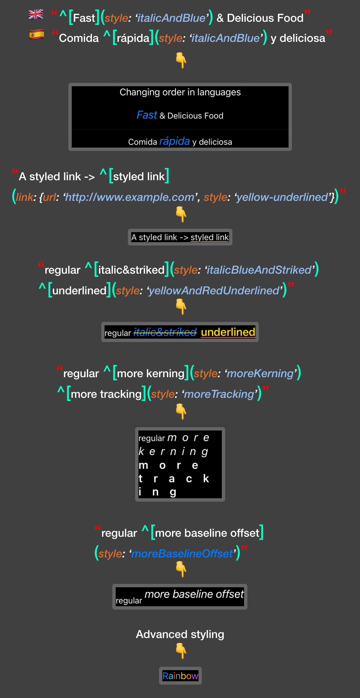

<p align="center">

</p>

<p align="center">
iOS 15.0 / macOS 12.0 / tvOS 15.0 / watchOS 8.0
</p>

iOS 15 comes with markdown string support. By default, you can style your strings with standard markdown syntax like **`**bold**`** and *`*italic*`*
This is nice, but there is usually a need to specify more complex styling styling like `font type`, `text color` etc.

---

StyledMarkdown is a mini library that lets you define custom styles in code and use those styles in your localized markdown strings.

- Define your custom styles via specifying attributes like custom fonts, text colors, underline styles and more, and name those syles.
- Use those style names in your markdown strings.
- Using StyledMarkdown, provide your custom style definitions and markdown strings which are using those custom styles' names, and create `SwiftUI` `Text` views or just `AttributedString`s for `UIKit`.

With this approach, you do not have to define a custom `AttributedStringKey` each time you want a custom style in your markdown, as this is already done in StyledMarkdown.

## Examples
<p align="center">

</p>

## Sample usage

```
let normalStyle = Style { style in
	style.font = .subheadline
	style.foregroundColor = .red
}

let boldStyle = Style { style in
	style.font = Font.italic(.system(size: 20))()
	style.foregroundColor = .blue
}

let myStyleGroup = StyleGroup(
	base: normalStyle,
	[
		"bold": boldStyle
	]
)

Text(
	"Hey ^[buddy](style: 'bold')",
	styleGroup: myStyleGroup
)

// or

AttributedString(
	localized: "Hey ^[buddy](style: 'bold')",
	styleGroup: myStyleGroup
)
```

***The idea of StyleGroup and named Styles comes directly from [`SwiftRichString` library by `Daniele Margutti` on GitHub](https://github.com/malcommac/SwiftRichString). Some of the code from there is also used in this package.***

## Supported modifiers

#### font(*SwiftUI.Font*)
#### foregroundColor(*Color*)
#### strikethrough(*Color*)
#### strikethroughStyle(*NSUnderlineStyle*)
#### underline(*Color*)
#### underlineStyle(*NSUnderlineStyle*)
#### kerning(*CGFloat*)
#### tracking(*CGFloat*)
#### baselineOffset(*CGFloat*)

### Advanced styling

```

let rainbow: [Color] = [
	.blue, .teal, .red, .gray, .yellow, .orange, .purple
]

let rainbowStyleGroup = StyleGroup(
	styleCustom: { source in
		var attrString = source
		for run in attrString.runs {
			let currentRange = run.range
			var index = currentRange.lowerBound
			var colorCounter: Int = 0
			while index < currentRange.upperBound {
				let nextIndex = attrString.characters.index(
					index,
					offsetBy: 1
					)
				attrString[index ..< nextIndex].foregroundColor = rainbow[colorCounter]
				colorCounter += 1
				if colorCounter >= rainbow.count {
					colorCounter = 0
				}
				index = nextIndex
			}
		}
		return attrString
	}
)

Text(
	"Rainbow",
	styleGroup: rainbowStyleGroup
)

// or

AttributedString(
	localized: "Rainbow",
	styleGroup: rainbowStyleGroup
)
```
_Parts of the above code for rainbow styling is taken from WWDC'21 sample app project called Caffe, Copyright © 2021 Apple Inc._

### 🔗 Links

You can add links inside your strings using the custom `link` `AttributedStringKey`:
`^[styled link](link: {url: 'http://www.example.com', style: 'linkStyle'})`

### iOS Automatic grammar agreement

Automatic grammar agreement's `inflect` property works with StyledMarkdown styles.

`^[2 salad](style: 'italic', inflect: true)`

generates
`2 salads` with italic style.

### 🎆 Images (not supported)

It is currently not supported to include `Image` elements within `AttributedString`.
